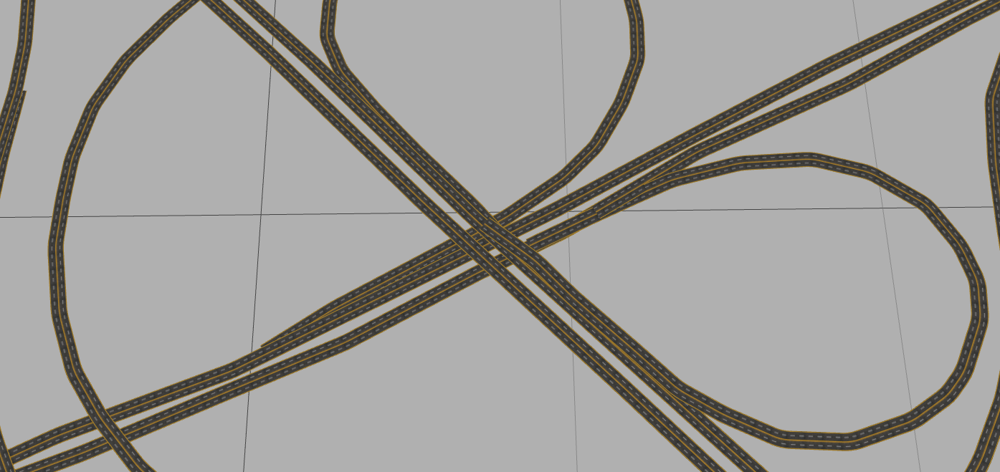
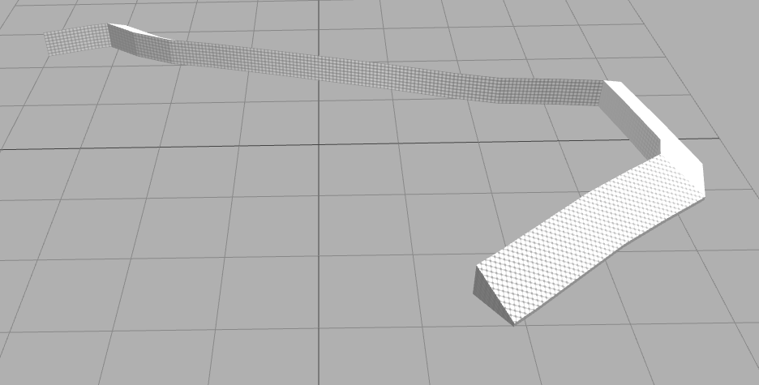

# poly-extrude

Extrude polygons/polylines. Born in [maptalks.three](https://github.com/maptalks/maptalks.three) project<br>

## Examples

[](https://deyihu.github.io/poly-extrude/test/building.html)

[](https://deyihu.github.io/poly-extrude/test/buildings.html)

[](https://deyihu.github.io/poly-extrude/test/multi-polygon.html)<br>
[](https://deyihu.github.io/poly-extrude/test/street.html)<br>
[](https://deyihu.github.io/poly-extrude/test/line-uv.html)<br>
[](https://deyihu.github.io/poly-extrude/test/ny-building.html)<br>
[](https://deyihu.github.io/poly-extrude/test/cylinder.html)<br>
[](https://deyihu.github.io/poly-extrude/test/brige.html)<br>
[](https://deyihu.github.io/poly-extrude/test/spring.html)<br>
[](https://deyihu.github.io/poly-extrude/test/expand-paths-brige.html)<br>
[](https://deyihu.github.io/poly-extrude/test/slope.html)<br>

[](https://deyihu.github.io/poly-extrude/test/tube.html)<br>

## Install

### NPM

```sh
npm i poly-extrude
```

### CDN

```html
<script type="text/javascript" src="https://unpkg.com/poly-extrude/dist/poly-extrude.js"></script>
```

## Use

```js
  import {
      extrudePolygons,
      extrudePolylines,
      cylinder,
      expandPaths,
      extrudeSlopes,
      expandTubes
  } from 'poly-extrude';

  //if you use cdn,the namespace is polyextrude

  //   const {
  //       extrudePolygons,
  //       extrudePolylines
  //   } = window.polyextrude;

  const polygons = [
      //polygon
      [
          //outring
          [
              [x, y],
              [x, y],
              ...........
          ],
          //holes
          [
              [x, y],
              [x, y], ...........
          ],
          ........

      ],
      //other polygons
      ......
  ];

  const polylines = [
      // polyline
      [
          [x, y],
          [x, y],
          ...........
      ],
      //polyline
      [
          [x, y],
          [x, y],
          ...........
      ],
  ];

  const result = extrudePolygons(polygons, {
      depth: 2
  });
  const {
      positon,
      normal,
      uv,
      indices
  } = result;
  //do something
```

## API


### `extrudePolygons(polygons, options)`

* `polygons`
* `options.depth`

```js
  const result = extrudePolygons(polygons, {
      depth: 2
  });
  const {
      positon,
      normal,
      uv,
      indices
  } = result;
  //do something
```


### `extrudePolylines(lines, options)`

* `lines`
* `options.depth`
* `options.lineWidth`
* `options.bottomStickGround`  Is the bottom attached to the ground 
* `options.pathuV`  generate Path UV

```js
   const result = extrudePolylines(polylines, {
       depth: 2,
       lineWidth: 2
   });
   const {
       positon,
       normal,
       uv,
       indices
   } = result;
   //do something
```


### `cylinder(center, options)`

* `center`
* `options.radius`
* `options.height`
* `options.radialSegments`

```js
const center = [0, 0];
const result = cylinder(center, {

    radius: 1,
    height: 2,
    radialSegments: 6

});
const {
    positon,
    normal,
    uv,
    indices

} = result;
//do something
```


### `expandPaths(lines, options)`

* `lines`
* `options.lineWidth`

```js
const result = expandPaths(polylines, {

    cornerRadius: 0.5,
    lineWidth: 2

});
const {

    positon,
    normal,
    uv,
    indices

} = result;
//do something
```


### `extrudeSlopes(lines, options)`

* `lines`
* `options.depth`
* `options.lineWidth`
* `options.side` Which side serves as the slope, 'left' or 'right'
* `options.sideDepth` slope depth 
* `options.bottomStickGround` Is the bottom attached to the ground
* `options.pathuV`  generate Path UV

```js
const result = extrudeSlopes(polylines, {

    depth: 1,
    side: 'left',
    sideDepth: 0,
    lineWidth: 2

});
const {

    positon,
    normal,
    uv,
    indices

} = result;
//do something
```


### `expandTubes(lines, options)`

* `lines`
* `options.radius`
* `options.radialSegments`

```js
const result = expandTubes(polylines, {

    radius: 1,
    radialSegments: 8

});
const {

    positon,
    normal,
    uv,
    indices

} = result;
//do something
```
